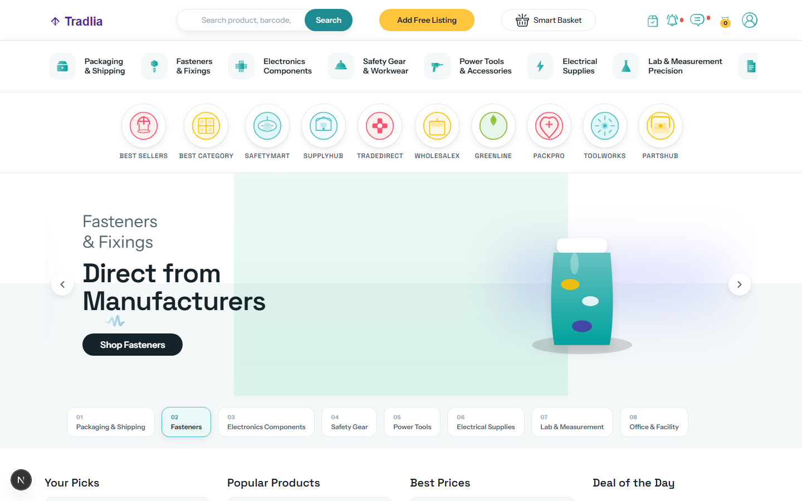
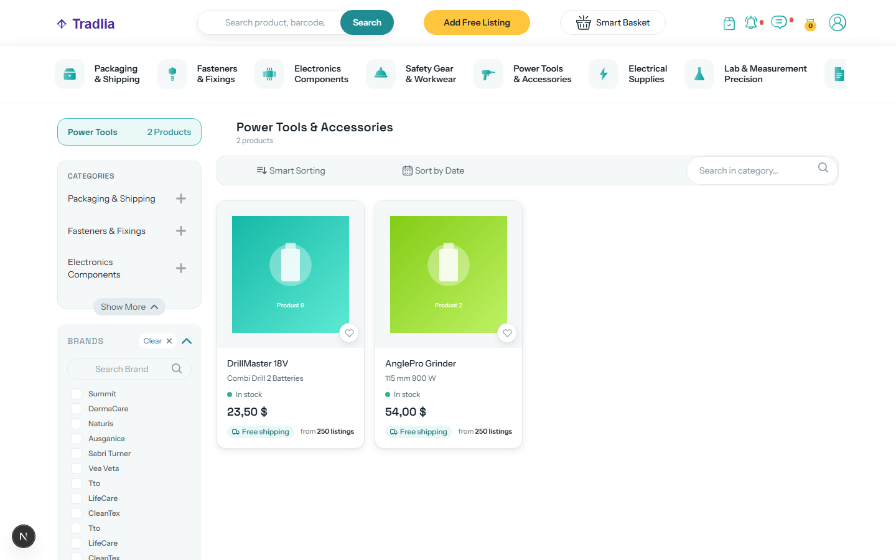
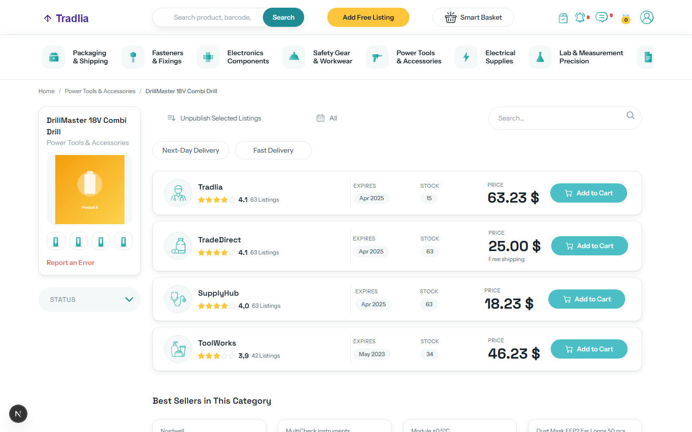
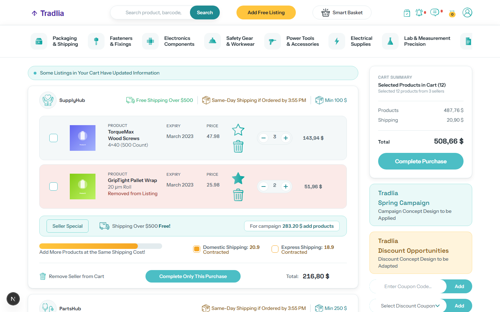
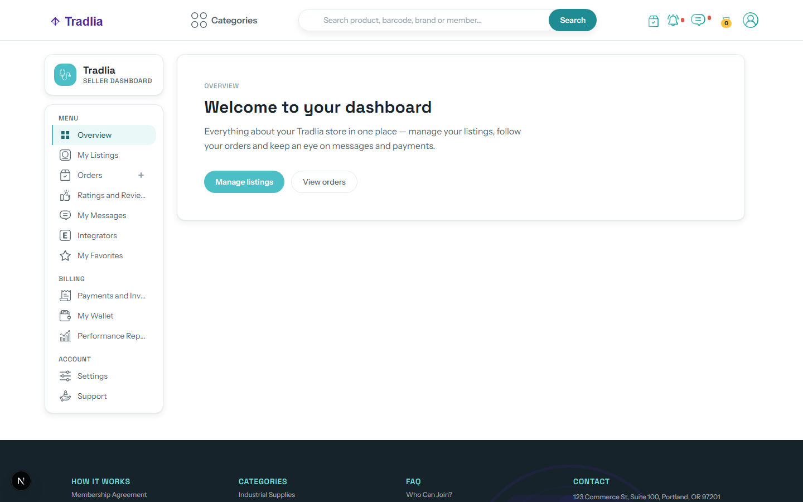
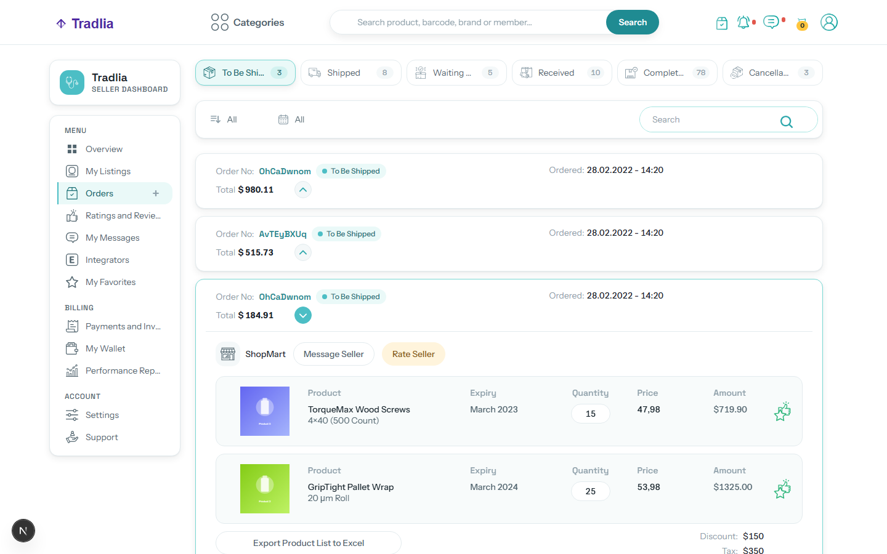
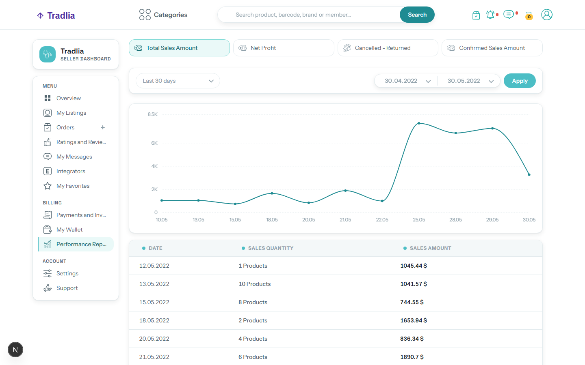

# Tradlia — B2B Marketplace & Seller Dashboard (Demo)

A full-featured B2B marketplace storefront and seller dashboard — category browsing, multi-seller product pages, smart basket, checkout, and a 13-section account area — built with Next.js 15, React 19, and Tailwind CSS 4.

> ⚠️ **Demo project** — all company names, product names, seller identities, prices, and data are entirely fictional. This is a portfolio piece and is not associated with any real business.

## Features

### Storefront

- **Category browsing** — 8 neutral B2B categories (Packaging & Shipping, Fasteners & Fixings, Electronics Components, Safety Gear & Workwear, Power Tools & Accessories, Electrical Supplies, Lab & Measurement, Office & Facility), each with subcategory filters
- **Product pages** — wired to a shared catalog via `?id=`, with seller offers, ratings, breadcrumbs, and related-product rails
- **Search** — live results with persisted recent searches
- **Smart basket** — build a request list row by row; a match meter shows how much of your list the catalog can fulfil
- **Basket + checkout flow** — cart management with quantity steppers and a dedicated payment step

### Seller Dashboard

A complete account area under `/profile`:

- **Adverts** — online/offline listings, waiting-approval queue, add/edit flows
- **Favourites** — saved products with list/grid views and remove confirmation
- **Feedback** — ratings and reviews you received
- **Integrators** — third-party integration connections
- **Messages** — message center
- **Orders (bought / sold)** — full order lifecycle with status chips (pending → shipped → delivered, cancelled/returned)
- **Receipts** — invoices and receipts including print views for invoices and shipping labels
- **Reports** — performance reports with charts (Recharts): sales, net profit, purchases, cancellations/returns
- **Settings** — profile, notifications, password, shipment, addresses, and sales rules
- **Support tickets** — searchable ticket list with a new-ticket modal
- **Wallet** — balance plus discount coupons

## Design System

| Aspect | Details |
|---|---|
| Brand color | Teal anchor `#4CBEC5` with a full brand ramp (`brand-50` → `brand-900`) |
| Typography | Space Grotesk (display) + Instrument Sans (body), self-hosted via `next/font` |
| Theming | Token-driven Tailwind theme: color ramps, ink/canvas/surface neutrals, radii, shadows |
| Signature element | "Order pulse" dot (`.pulse-dot`) used for stock badges and order lifecycle chips |
| Motion | Shared duration/easing tokens (`styles/tokens.css`) with `prefers-reduced-motion` fallbacks |
| Accessibility | Keyboard focus rings (`focus-visible`), ARIA labels on interactive controls, semantic landmarks |

## Tech Stack

| Category | Technology |
|---|---|
| Framework | Next.js 15 (Pages Router) |
| UI Library | React 19 |
| Language | TypeScript 5 |
| Styling | Tailwind CSS 4, Sass (SCSS modules) |
| Charts | Recharts |
| Carousels | Swiper |
| Notifications | React Toastify |
| Linting | ESLint 9 (flat config) |

## Getting Started

Requires Node.js ≥ 18.18.

```bash
# Install dependencies
npm install

# Run development server
npm run dev

# Build for production
npm run build

# Run linter
npm run lint
```

Open [http://localhost:3000](http://localhost:3000) in your browser.

## Screenshots

| | |
|---|---|
|  |  |
| *Home* | *Category browsing* |
|  |  |
| *Product page* | *Basket* |
|  |  |
| *Seller dashboard* | *Order lifecycle* |
|  | |
| *Performance reports* | |

## Project Structure

```
tradlia-client/
├── pages/                 # Next.js routes (storefront + profile dashboard)
├── components/
│   ├── basket/            # Cart & checkout
│   ├── category/          # Category listing & filters
│   ├── home/              # Homepage sections
│   ├── product/           # Product detail & seller offers
│   ├── profile/           # Seller dashboard modules (orders, adverts, reports…)
│   ├── integrator/        # Integrator connection modal
│   ├── sellerModal/       # Seller detail modal
│   └── shared/            # Navbar, footer, layout, shared filters
├── helpers/
│   ├── contexts/          # React contexts (BasketContext)
│   ├── hooks/             # Custom hooks (useLocalStorage, useMediaQuery)
│   └── svgs/              # SVG icon components
├── styles/                # Global styles, design tokens, Tailwind entry
├── public/images/         # Product images, icons
└── types/                 # Shared TypeScript types
```

## Credits

Built by [Burak](https://www.upwork.com/freelancers/~018b6a727c2790d85d).

## License

MIT
